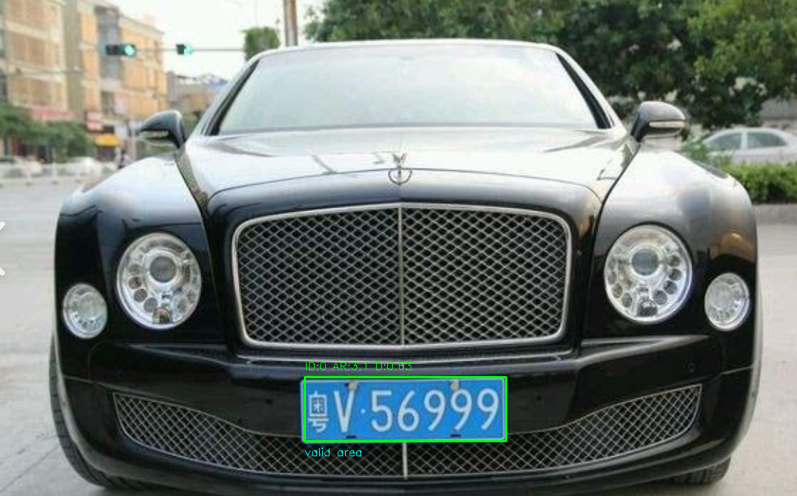
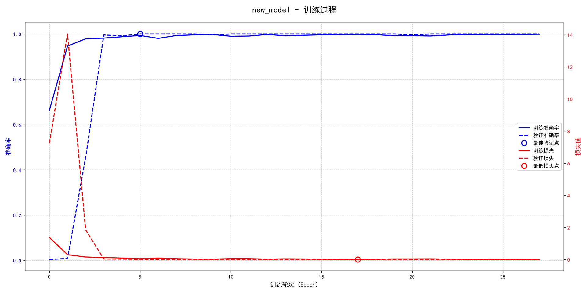
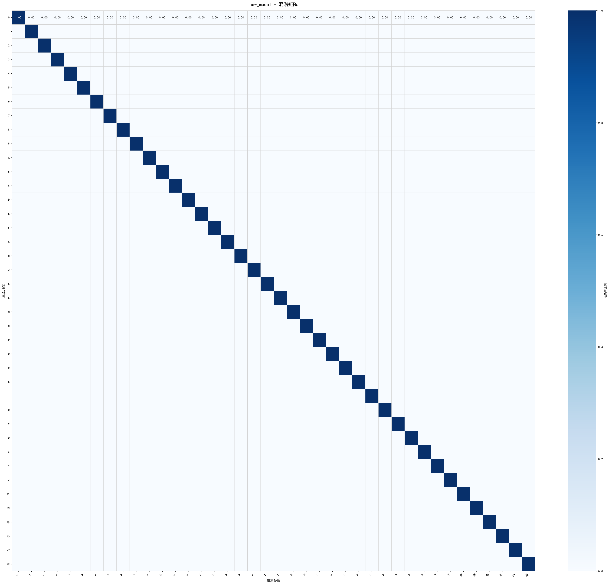

# 车牌识别

机器学习与模式识别方向

停车场车牌识别系统的技术实现  
**内容**：基于颜色掩膜、开闭运算等计算机视觉技术进行车牌定位和字符分割  
对传统LeNet-5模型架构进行改进，进一步提高字符识别准确率  
**亮点**：基于LeNet-5模型，使用批量归一化技术，使用更好的ReLU激活函数替换掉双曲正切函数解决梯度消失与过饱和问题  
使用早停和dropout等正则化技术提升模型泛化能力  




## 项目亮点

- **端到端识别流程**：从原始图片中定位车牌区域，完成字符分割，并调用 CNN 模型输出识别结果。
- **传统视觉 + 深度学习结合**：定位阶段使用 HSV 颜色空间、形态学处理、轮廓筛选和长宽比/密度过滤；识别阶段使用 TensorFlow/Keras 训练字符分类模型。
- **训练评估闭环完整**：训练脚本会自动生成训练曲线、混淆矩阵、类别性能柱状图和指标汇总图，便于复盘模型表现。
- **中文车牌字符适配**：类别集合覆盖数字、常用大写字母以及部分省份简称字符，支持中国蓝牌场景的基础识别实验。
- **结果可解释性强**：中间结果会保存到 `located_plate.jpg`、`characters/`、`final_result2/` 和 `results/`，方便展示定位、分割、预测各环节。

## 技术栈

| 模块 | 技术 |
| --- | --- |
| 图像读取与预处理 | OpenCV, NumPy |
| 车牌定位 | HSV 色彩阈值、形态学开闭运算、轮廓检测 |
| 字符分割 | 二值化、投影/轮廓筛选、字符区域规范化 |
| 字符识别 | TensorFlow, Keras CNN |
| 模型评估 | scikit-learn, Matplotlib, Seaborn, Pandas |

## 目录结构

```text
.
├── recognization.py              # 推理主流程：车牌定位、字符分割、字符预测
├── model_training.py          # 训练主流程：数据加载、模型训练、评估可视化
├── models/                      # 已训练模型权重
├── results/                     # 训练曲线、混淆矩阵、类别指标等结果图
├── characters/                  # 分割出的单字符图片
├── valid_recognized/               # 车牌候选框/定位过程输出
├── tf_car_license_dataset/      # 训练、验证、测试数据
├── test*.png                    # 示例输入图片
├── docs/                        # 部署、使用、架构和发布文档
└── requirements.txt             # Python 依赖
```

## 快速开始

### 1. 创建环境

建议使用 Python 3.10 或 3.11。

```bash
python -m venv .venv
.venv\Scripts\activate
pip install -r requirements.txt
```

### 2. 运行车牌识别流程

默认输入图片在 `车牌定位分割.py` 底部的 `image_path = "test6.png"`，默认模型为 `models/best_new_model.h5`。

```bash
python recognization.py
```

运行后会生成或更新：

- `located_plate.jpg`：定位并裁剪出的车牌区域
- `characters/char_*.png`：分割后的字符图片
- `final_result2/plate_located.png`：候选框筛选可视化
- 终端输出：逐字符预测结果、置信度和最终识别字符串

### 3. 重新训练字符识别模型

```bash
python model_training.py
```

训练脚本默认读取：

- `tf_car_license_dataset/train_images/training-set`
- `tf_car_license_dataset/train_images/validation-set`

训练后会输出：

- `best_new_model.h5`
- `results/new_model_training_history.png`
- `results/new_model_confusion_matrix.png`
- `results/new_model_class_performance.png`
- `results/new_model_summary_table.png`

## 示例结果

### 字符分割

`characters/` 中保留了当前样例车牌分割出的单字符图片：


### 模型训练结果





## 文档

- [部署指南](docs/DEPLOYMENT.md)
- [使用说明](docs/USAGE.md)
- [系统架构](docs/ARCHITECTURE.md)
- [项目展示文案](docs/PROJECT_SHOWCASE.md)
- [GitHub 发布检查清单](docs/GITHUB_RELEASE_CHECKLIST.md)

## 适合展示的能力点

- 能独立完成计算机视觉任务从数据、训练、推理到可视化评估的闭环。
- 理解传统图像处理在小样本、规则场景中的工程价值，并能与 CNN 模型组合使用。
- 能通过混淆矩阵、分类报告和类别分布分析模型效果，而不是只关注单一准确率。
- 能将实验型代码整理成可运行、可复现、可展示的 GitHub 项目。

## 注意事项

- 当前定位逻辑主要针对**蓝色车牌**，黄牌、绿牌、新能源牌照或复杂光照场景需要扩展颜色阈值和候选框筛选策略。
- 当前脚本包含 `cv2.imshow()` 和 `matplotlib` 图形窗口，适合本地桌面环境运行；服务器或无 GUI 环境建议参考部署文档中的无界面运行建议。
- `python/` 本地虚拟环境、`.idea/`、压缩包和大体积数据文件不建议上传到 GitHub，可使用 `.gitignore` 或 Git LFS 管理。
