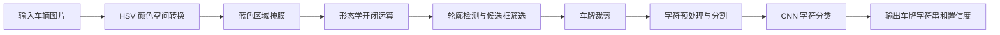

# 系统架构

## 1. 总体流程



## 2. 车牌定位模块

文件：`车牌定位分割.py`

核心函数：

- `locate_license_plate(image_path)`：读取原图，定位并裁剪车牌。
- `visualize_step(title, image, color_conversion=None)`：展示中间处理图。

主要策略：

- 将 BGR 图片转换为 HSV。
- 使用蓝色 HSV 阈值提取候选区域。
- 使用矩形结构元素进行开运算和闭运算，减少噪声并连接车牌字符区域。
- 通过轮廓外接矩形计算面积、长宽比和白色像素密度。
- 选择符合车牌几何特征的最大候选区域。

适用场景：

- 蓝色车牌
- 车牌区域比较清晰
- 车牌在图片中占有一定比例

## 3. 字符分割模块

文件：`车牌定位分割.py`

核心函数：

- `improved_preprocess_plate_image(plate_img)`：灰度化、CLAHE 增强、自适应阈值等预处理。
- `improved_split_characters(processed_img, original_img)`：检测并筛选字符候选区域。
- `refine_character(char_img, extra)`：规范化单字符图像。
- `save_characters(characters, output_dir="characters")`：保存字符图片。
- `process_license_plate(plate_img)`：组织完整分割流程。

输出：

```text
characters/
├── char_0.png
├── char_1.png
└── ...
```

## 4. 字符识别模块

文件：`车牌定位分割.py`

核心函数：

- `load_model(model_path)`：加载 Keras 模型。
- `preprocess_image(image_path, img_size=(40, 32))`：将单字符图像处理为模型输入。
- `predict_characters(model, characters_folder)`：逐字符预测并汇总结果。
- `main(mod_path)`：加载模型并启动预测。

模型输入：

```text
(batch, 40, 32, 1)
```

模型输出：

```text
类别概率分布 -> argmax -> 字符类别
```

## 5. 训练模块

文件：`字符字母数字识别.py`

核心函数：

- `safe_image_dataset_from_directory(...)`：读取目录数据并处理文件夹到类别的映射。
- `create_main_model()`：基础 CNN 模型。
- `create_enhanced_lenet()`：增强版 LeNet/CNN 模型。
- `train_model(...)`：编译、训练、保存最佳模型。
- `visualize_results(...)`：生成训练和评估图表。
- `validate_and_count_dataset(...)`：统计类别分布。

训练配置：

```python
IMG_SIZE = (40, 32)
BATCH_SIZE = 64
```

训练产物：

```text
best_new_model.h5
new_model_20260625_190227.keras
```

## 6. 工程改进方向

当前项目已经覆盖算法闭环，但如果继续做成更成熟的工程项目，建议按优先级推进：

1. 为两个脚本增加命令行参数，例如 `--image`、`--model`、`--output-dir`、`--no-gui`。
2. 拆分模块，将定位、分割、训练、推理分别放入 `src/`。
3. 增加批量推理脚本，输出 CSV 或 JSON 结果。
4. 增加自动化测试，至少覆盖图像读取、字符预处理、模型输入 shape。
5. 支持多颜色车牌，包括蓝牌、绿牌、黄牌。
6. 将模型导出为 SavedModel、ONNX 或 TensorFlow Lite，便于部署。
7. 增加 Web/API 演示层，例如 FastAPI + 简单上传页面。
